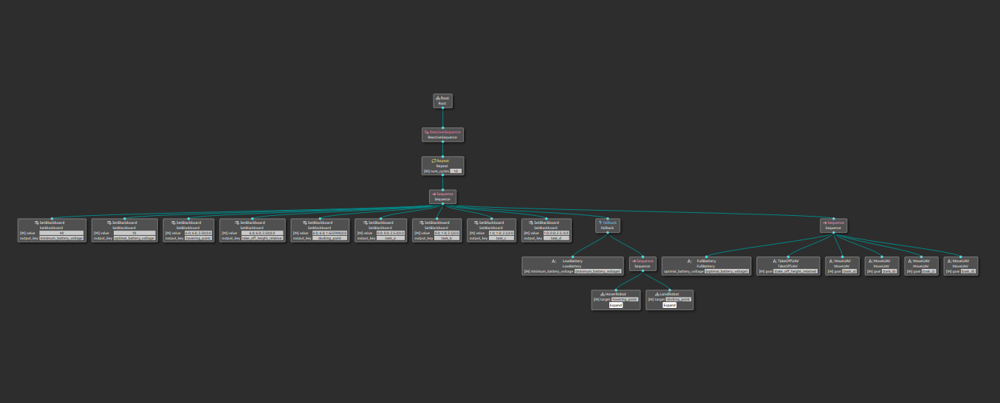
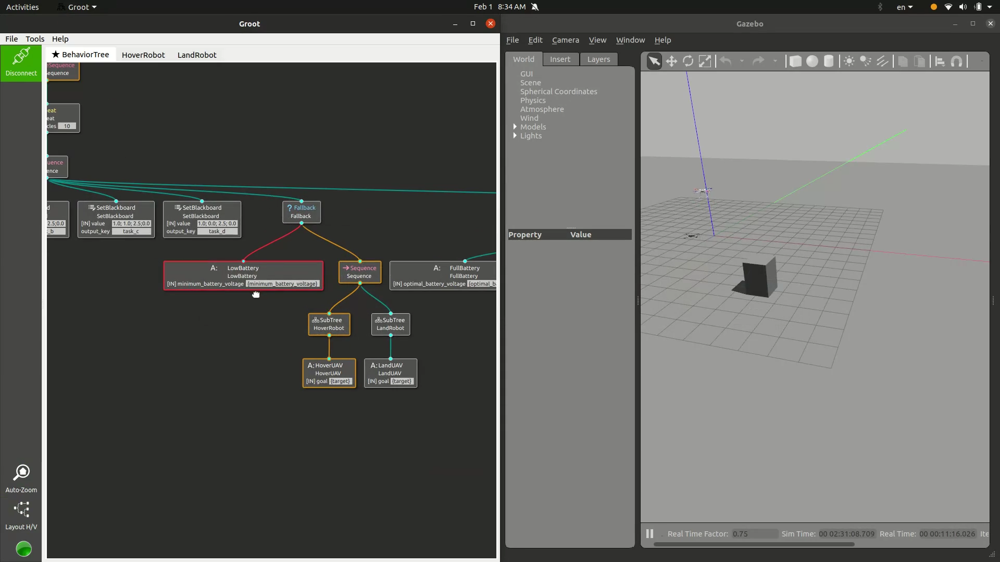
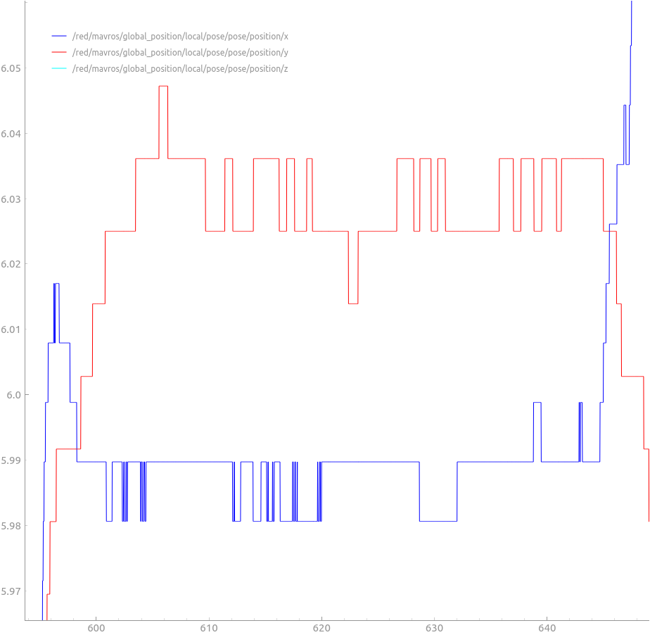

# UAV docking

Quadcopter autonomous docking on a charging platform

A behaviour tree based  drone docking node. The node uses a beahvior_tree_v3 library to specify the mission. Specify the drone mission in an XML file, and start the node.

In this scope the following Actions have been implemented

## Implemented Behavior Nodes

### LowBattery

checks the battrey voltage and compares it to the minimum voltage charging requirment

### FullBattery

checks the battrey voltage and compares it to the optimal voltage charging requirment for take off action

### MoveUAV

Given a 3D pose this nodes generats intermidiate waypoints for the controller to reach the pose and waits untill given pose is reached

### HoverUAV

from a 3D pose this nodes generats intermidiate waypoints for the controller to reach the hover pose

### LandUAV

for a dron at a hovering state at some height from the docking station this node makes sure the droe descends verticaly to until the docking station is reached

### TakeOffUAV

for a drone at a charged state  but still in charging station this node arms the drone and takesoff to a given height from the docking station

## Parameters

the tree xml in config/tree/docking.xml has default parameters

- minimam battery voltage
- optimal battery voltage
- hovering height and position
- docking height and position
- takeoff height
- sample moving pose tasks(task_a, task_b ...) (Core Mission)

and the follwing ros parameters

- battery/charging : true || false
- battery/charged : true || false

for testing purposes this are manualy set but in the future there should be indepent service with sensor to set this params

this parameters should be modified accordingly before running

proper topic remmaping is also required

- this node subscripes to

  - odometry topic(mavros/global_position/local)
  - battery topic(mavros/battery)
  - trajectory tracker status(tracker/status)

- this node publishes to

  - traker input pose(tracker/input_pose)
  - (joy)

- services

  - landing service(land)
  - arming service(mavros/cmd/arming)
  - set_mode service(mavros/set_mode)
  - takeoff service(takeoff)


## Instalation

```bash
    sudo apt install ros-noetic-behaviortree-cpp-v3
    cd <catking workspace/src>
    git clone git@github.com:brukg/uav_docking.git
    catkin build
    source devel/setup/bash or source devel/setup.zsh
```

## Usage

 start simulator this package uses the [uav_ros_simulator](https://github.com/larics/uav_ros_simulation) from university of zagreb larics lab

 once the simulator is up and running

```bash
    roslaunch uav_docking start.launch 

```

## Results

behavior tree for checking battery and moving to charging station




simlation video click below

[](https://drive.google.com/file/d/150pEg5Zz8GYzy0WQN0azPpQbM6Rg_jkZ/view?resourcekey&usp=slides_web)

bellow is xy postion plot the target xy pose(6,6)


