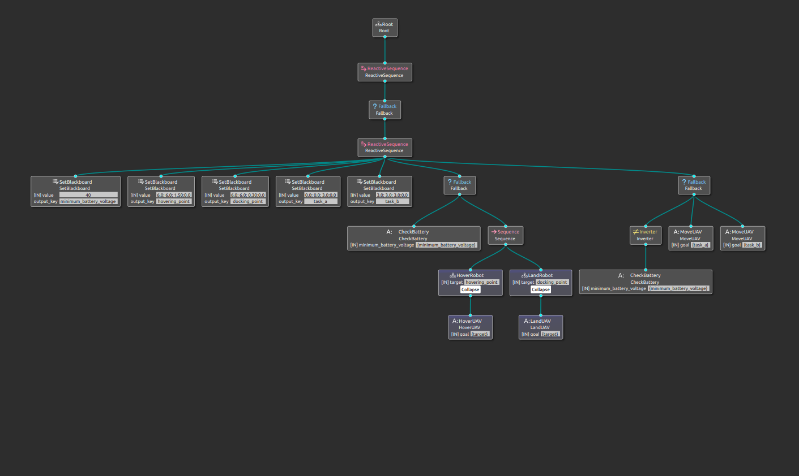

# UAV docking

Quadcopter autonomous docking on a charging platform

A behaviour tree based  drone docking node. The node uses a beahvior_tree_v3 library to specify the mission. Specify the drone mission in an XML file, and start the node.

In this scope the following Actions have been implemented

## Condition

### BatteryLOW

checks the battrey voltage and compares it to the minimum voltage charging requirment

## Nodes

### MoveUAV

Given a 3D pose this nodes generats intermidiate waypoints for the controller to reach the pose and waits untill given pose is reached

### LandUAV

for a dron at a hovering state at some height from the docking station this node makes sure the droe descends verticaly to until the docking station is reached

## Instalation

```bash
    sudo apt install ros-noetic-behaviortree-cpp-v3
    cd <catking workspace/src>
    git clone git@github.com:brukg/uav_docking.git
    catkin build
    source devel/setup/bash or source devel/setup.zsh
```

## Usage

 start simulator this package uses the [uav_ros_simulator](https://github.com/larics/uav_ros_simulation) from university of zagreb larics lab

 once the simulator is up and running

```bash
    roslaunch uav_docking start.launch 

```

## Results

behavior tree sample

<!--  -->


